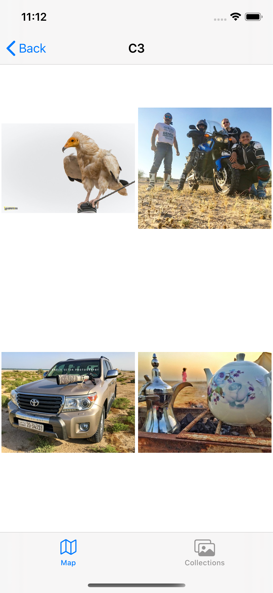

# Virtual-Tourist

> This app allows users specify travel locations around the world, and create virtual photo albums for each location. The locations and photo albums will be stored in Core Data. Also, the app has the feature of saving collections.


[![Swift Version][swift-image]][swift-url]
[](https://img.shields.io/cocoapods/v/LFAlertController.svg)  
[](http://cocoapods.org/pods/LFAlertController)


## View Controllers
 The app will have four view controller scenes.

• Map View Controller: Allows the user to drop pins around the world.

• Photo Album View Controller : Allows the users to download and edit an album for a location.

• Collection List View Contoller: Allows the users to see list of saved collections.

• Collection Details View Controller: Allow the users to look into the details of saved collection.


**Travel Locations Map View** When the app first starts it will open to the map view. Users will be able to zoom and scroll around the map using standard pinch and drag gestures. The center of the map and the zoom level should be persistent. If the app is turned off, the map should return to the same state when it is turned on again. Tapping and holding the map drops a new pin. Users can place any number of pins on the map. When a pin is tapped, the app will navigate to the Photo Album view associated with the pin.


**Photo Album View**: Photo Album If the user taps a pin that does not yet have a photo album, the app will download Flickr images associated with the latitude and longitude of the pin. If no images are found a “No Images” label will be displayed. If there are images, then they will be displayed in a collection view. While the images are downloading, the photo album is in a temporary “downloading” state in which the New Collection button is disabled. The app should determine how many images are available for the pin location, and display a placeholder image for each.

Once the images have all been downloaded, the app should enable the New Collection button at the bottom of the page. Tapping this button should empty the photo album and fetch a new set of images. Note that in locations that have a fairly static set of Flickr images, “new” images might overlap with previous collections of images. Users should be able to remove photos from an album by tapping them. Pictures will flow up to fill the space vacated by the removed photo. All changes to the photo album should be automatically made persistent. Tapping the back button should return the user to the Map view. If the user selects a pin that already has a photo album then the Photo Album view should display the album and the New Collection button should be enabled.


**Collection List View Contoller**: If the user would like to save the collection, he can press of the save button which will take him to this view. First, He will be aske d to enter a name for the collection to be saved. then, the saved collection will be added to the table list presnting the name of the collection and  number of photos in that collection.




**Collection Details View Controller**: Here the user can see the photos of saved collection


## Requirements

- iOS 12.0+
- Xcode 10

## Installation

Open terminal and change you current directory

`$ cd /Users/user/project_folders`

Clone project repository

`$ git clone https://github.com/adeebx1/Virtual-Tourist`


If you dont have cocoapods installed, install it and run the following command in the ``/Users/user/project_folders``:

`$ pod install`

After installing the pods you can open the project in Xcode and run it.

#### CocoaPods
Installed CocoaPods `Kingfisher`, `alamofire`, and `swiftyjson`  :

```ruby
pod 'Kingfisher', '~> 5.0'
pod 'Alamofire', '4.9.1'
pod 'SwiftyJSON', '~> 4.0'
``` 


[swift-image]:https://img.shields.io/badge/swift-5.0-orange.svg
[swift-url]: https://swift.org/
[license-image]: https://img.shields.io/badge/License-MIT-blue.svg
[license-url]: LICENSE
[travis-image]: https://img.shields.io/travis/dbader/node-datadog-metrics/master.svg?style=flat-square
[travis-url]: https://travis-ci.org/dbader/node-datadog-metrics
[codebeat-image]: https://codebeat.co/badges/c19b47ea-2f9d-45df-8458-b2d952fe9dad
[codebeat-url]: https://codebeat.co/projects/github-com-vsouza-awesomeios-com
